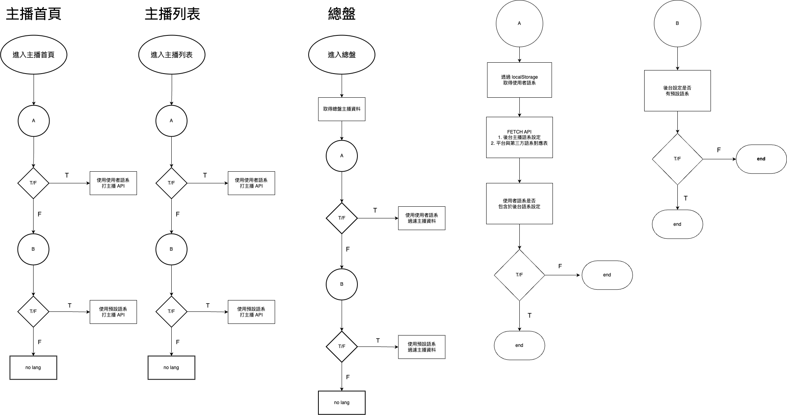

## IM-Monorepo

- [Requirement](#Requirement)
- [Folder Structure](#FolderStructure)
  - [apps](#FolderStructure_apps)
    - [library](#FolderStructure_apps_library)
    - [mockServer](#FolderStructure_apps_mockServer)
    - [uikit](#FolderStructure_apps_uikit)
  - [packages](#FolderStructure_packages)
    - [api](#FolderStructure_packages_api)
    - [assets](#FolderStructure_packages_assets)
    - [env-config](#FolderStructure_packages_env-config)
    - [eslint-config-custom](#FolderStructure_packages_eslint-config-custom)
    - [node-env](#FolderStructure_packages_node-env)
    - [protobuf](#FolderStructure_packages_protobuf)
    - [tailwind-config](#FolderStructure_packages_tailwind-config)
    - [ui](#FolderStructure_packages_ui)
    - [utils](#FolderStructure_packages_utils)
    - [vd-resource](#FolderStructure_packages_vd-resource)
- [Release Flow](#ReleaseFlow)
- [Mock Data Server](#MockDataServer)
- [LocalStorage](#LocalStorage)
- [Local Development](#LocalDevelopment)
- [Embedded In Platform](#Embedded_In_Platform)
- [Theme](#Theme)
- [Locales](#Locales)
  - [script](#Locales_script)
  - [localStorage](#Locales_localStorage)
  - [anchor](#Locales_anchor)
- [Device](#Device)
- [Chatroom](#Chatroom)
- [Postcss Root Selector](#Postcss_Root_Selector)
- [Unit Testing](#Unit_Testing)
- [Issues](#Issues)

---

### <a name='Requirement'></a>Requirement 

Build Tool : [Turbo ≥ 1](https://turbo.build/repo)
Package Manager : [Pnpm ≥ v8](https://pnpm.io)
Environment : [Node ≥ v16.x](https://nodejs.org/en)

>
> [Pnpm v.s Node Version Compatibility](https://pnpm.io/zh-TW/installation#compatibility)
>
> turbo 需要安裝在電腦全域的 npm module
> (或許能只安裝在專案內，需測試)

---

### <a name='FolderStructure'></a>Folder Structure 

#### <a name='FolderStructure_apps'></a>apps

For more detail see [README](./apps/README.md) .

##### <a name='FolderStructure_apps_library'></a>library

For more detail see [README](./apps/library/README.md) .

##### <a name='FolderStructure_apps_mockServer'></a>mockServer

For more detail see [README](./apps/mockServer/README.md) .

##### <a name='FolderStructure_apps_uikit'></a>uikit

For more detail see [README](./apps/uikit/README.md) .

---

#### <a name='FolderStructure_packages'></a>packages

For more detail see [README](./packages/README.md) .

##### <a name='FolderStructure_packages_api'></a>api

For more detail see [README](./packages/api/README.md) .

##### <a name='FolderStructure_packages_assets'></a>assets

(unused)

##### <a name='FolderStructure_packages_env-config'></a>env-config

For more detail see [README](./packages/env-config/README.md) .

##### <a name='FolderStructure_packages_eslint-config-custom'></a>eslint-config-custom

For more detail see [README](./packages/eslint-config-custom/README.md) .

##### <a name='FolderStructure_packages_node-env'></a>node-env

For more detail see [README](./packages/node-env/README.md) .

##### <a name='FolderStructure_packages_protobuf'></a>protobuf

For more detail see [README](./packages/protobuf/README.md) .

##### <a name='FolderStructure_packages_tailwind-config'></a>tailwind-config

For more detail see [README](./packages/tailwind-config/README.md) .

##### <a name='FolderStructure_packages_ui'></a>ui

For more detail see [README](./packages/ui/README.md) .

##### <a name='FolderStructure_packages_utils'></a>utils

For more detail see [README](./packages/utils/README.md) .

##### <a name='FolderStructure_packages_vd-resource'></a>vd-resource

For more detail see [README](./packages/vd-resource/README.md) .

---

### <a name='ReleaseFlow'></a>Release Flow

For more detail see [README](./apps/library/env_scripts/README.md) .

---

### <a name='MockDataServer'></a>Mock Data Server

For more detail see [README](./apps/mockServer/README.md) .

---

### <a name='LocalStorage'></a>LocalStorage

目前有一些供測試或是與 `universe-portal-wap/` 相關的 localStorage 變數在使用：

1. `imVIPNotify` : 記錄專家頁面隱藏金色鎖頭的過期時間
2. `dev` : 設為 `true` 打開 ws 的 `debug mode`，可以參考 [聊天室文件](https://innotech.atlassian.net/wiki/spaces/GDIM/pages/2581922325/IM#%E7%B7%9A%E4%B8%8A%E9%99%A4%E9%8C%AF%E5%B7%A5%E5%85%B7)
3. `locale` : im 內的語系，會與平台的 `locale.current` 同步
4. `mock` : 設為 `true` 改打 mock data server
5. `dev_login` : 設為 `true` 可以在 im 專案執行平台登入動作
6. `imAllowTranslate` : 是否打開翻譯的參數
    `allow` = 是, `not-allow` = 否, `default` = 看預設值

> 目前散落在專案各處，未來可以統整在一起。

---

### <a name='LocalDevelopment'></a>Local Development
因為 im-library 是打包後被平台透過 npm 安裝下來的，
在本地若需測試兩個專案一起的話，
是透過 **vite watch mode** 的方式將專案打包至本地 `universe-portal-wap` 底下的 `node_modules/im-library`，是透過 `.env` 設定來控制打包路徑。

操作方式：

1. 將專案底下 apps/library/.env.development 複製一份並取名 .env
```bash
cp ./apps/library/.env.development ./apps/library/.env
```

2. 修改 .env 檔案內的 `PLATFORM_OUT_DIR` 參數成自己電腦裡 `universe-portal-wap` 的 `node_modules/im-library` 路徑
```properties
PLATFORM_OUT_DIR="{YOUR_PROJECT_BASE_PATH}/node_modules/im-library"
```

3. 在 apps/library/ 底下執行指令以 `watch mode` 形式打包到 `universe-portal-wap` 下
```bash
cd apps/library

pnpm run build:library-watch
```

4. 啟動平台專案

5. 只要 im-library 中有檔案異動，都會重新打包一次放到平台底下

---

### <a name='Embedded_In_Platform'></a>Embedded In Platform

For more detail see [README](./apps/library/src/platform/README.md) .

---

### <a name='Theme'></a>Theme

在專案啟動的時候根據 `env-config` 中的業主代號去抓該業主的主題色 mapping。

目前只有分`谷歌`及`瑞銀`兩主題色，其他業主都會是這兩個其中之一。

``` javascript
// packages/utils/vdThemeGenerator/map.ts

vd001: theme.ruiYin,
vd002: theme.guGe,
vd003: theme.guGe,
vd004: theme.ruiYin,
// vd005: theme.guGe,
vd006: theme.guGe,
vd007: theme.ruiYin,
vd008: theme.guGe,
vd009: theme.ruiYin

ruiYin: {
  primary: '76 158 234', // #4C9EEA
  secondary: '80 189 255' // #50BDFF
},
guGe: {
  primary: '12 24 108', // #0C186C
  secondary: '80 84 255' // #5054FF
}
```

取到對應的主題色 mapping 表後，會透過 js 將 `mapping 表` 轉換成 `css 變數表` 並以 `<style></style>` 包裹後插入至 `<head></head>` 中

```html
<style>:root {--im-monorepo-primary:76 158 234;
--im-monorepo-secondary:80 189 255;
}</style>
```

因為專案也有使用 `tailwind-css`，所以也會定義 `tailwind color extend`。
細節： `packages/tailwind-config/tailwind.present.cjs`
```javascript
colors: {
  imprimary: {
    DEFAULT: 'rgb(var(--im-monorepo-primary))'
  },
  imsecondary: {
    DEFAULT: 'rgba(var(--im-monorepo-secondary))'
  }
}
```
---

### <a name='Locales'></a>Locales

#### <a name='Locales_script'></a>script

For script detail see [README](./apps/library/env_scripts/README.md#locales) .

#### <a name='Locales_localStorage'></a>localStorage

For localStorage detail see [README](./apps/library/src/platform/README.md) .

#### <a name='Locales_anchor'></a>anchor

主播有一個語系機制比較特別：

1. 因為廣場是串接 51 第三方，而第三方語系跟我們的語系有差異，需要做對應
2. 後台可以控制哪些語系的主播可以呈現在前台，又分為指定語系與預設語系

##### flow chart



---

### <a name='Device'></a>Device

im 專案也有做 `rwd` 的設計，而實作方式基本上與 `universe-portal-wap` 的機制相同。

- md: 375px (手機)
- lg: 600px (平板)
- xl: 1024px (電腦)

1. 會在專案啟動時透過 `vite.config` 將裝置尺寸設定從 `tailwind.config` 讀取進來
2. 將設定透過 `vite.config` 的 `define` 功能定義至 `process.env.SCREENS` 變數
3. 會註冊一個全域的 `resize` 事件監聽當前畫面尺寸，再跟上述設定值做比對分辨現在屬於哪一種裝置。

兩種根據尺寸做調整`樣式/功能`的方法：

1. [tailwind responsive design](https://tailwindcss.com/docs/responsive-design)
2. 全局 svelte/store， `isMd`, `isLg`, `isXl` 及 `deviceSize`

```javascript

// tailwind
<div class='color-red lg:color-blue xl:color-green'></div>

// svelte(js) 
{#if $isXl}
  <div>我是電腦版看到的</div>
{:else if $isLg}
  <div>我是平板看到的</div>
{:else}
  <div>我是手機版看到的</div>
{/if}
```
---

### <a name='Chatroom'></a>Chatroom

For more detail see [README](./apps/library/src/containers/Chatroom/README.md) .

---

### <a name="Postcss_Root_Selector"></a>Postcss Root Selector

`im` 專案與 `universe-portal-wap` 專案都有在使用 `tailwindCSS` 寫樣式，之前遇到一個問題：

平台的樣式因為 `RWD` 的需求會有 `media-query` 的樣式覆寫：
```javascript
<div class='color-red-500 lg:color-blue-500 xl:color-white'></div>
```

可是 `media-query` 與一般樣式是屬於`同層級`的選擇器，只因載入順序與尺寸影響。
所以如果有一個一模一樣的樣式在載入順序上比平台的更後面時，會導致就算平台有使用 `media-query`，還是會被同名的樣式覆蓋。

EX: 
```javascript

// 載入 bundled CSS 的順序：
// 1. 平台 color-red-500 
// 2. 平台 lg:color-blue-500
// 3. 平台 xl:color-white
// 4. im color-red-500 

<div class='color-red-500 lg:color-blue-500 xl:color-white'></div>
```

這時候前面的 media-query 的樣式就會因為載入順序的關係被 im 的樣式覆蓋。

*workaround:*

引入 `postcss-add-root-selector` 套件，將 im 打包的 css 全部都加上 `.im-library` 的前綴，以此來跟平台的樣式區隔開，平台就不會在同名的 class 去引入 im 的樣式。

*drawbacks:*

所有會在平台底下使用的 im 組件都必須包裹一個有 `.im-library` 的外層 html 元素，包含會 portal 到 body 的也是。

如果有些 im 暴露出去的元素是套件 (ex: [mobile-select.js](https://github.com/onlyhom/mobile-select))，且能確保套件的樣式不會影響到平台，可以在 `postcss.config.cjs` 加上 `exclude` option 去濾掉某些樣式檔不用加前綴這件事。

```javascript
// postcss.config.cjs
module.exports = {
  plugins: {
    // ...
    'postcss-add-root-selector': {
      rootSelector: '.im-library',
      exclude: ['mobile-select.css']
    }
  }
}
```

---

### <a name='Unit_Testing'></a>Unit Testing

專案有用 [testing-library](https://testing-library.com/docs/svelte-testing-library/intro), [vitest](https://vitest.dev/) 做單元測試。

跑測試會涵蓋 `library,ui,utils 及 api 底下的 *.{test,spec}.{ts,js...}` 的檔案。

```bash
# testing
pnpm run test

# testing in watch mode
pnpm run test:watch
```

unit-testing 目前大多用來測試 function, class 的正確性，比較少用來測試組件。
因為 unit-testing 不好用來測試有異步行為邏輯的組件 (ex: 在生命週期下執行業務邏輯的行為)，組件多半是測試`傳入 props` 後的行為、`event 觸發`行為等等。

測試範例可以參考： `packages/utils/amount/amount.test.ts`


---

### <a name='Issues'></a>Issues

1. **type declaration**

    現在打包到平台使用的 svelte 組件沒有做 .d.ts 檔的宣告，所以只能暴力的使用 `//@ts-ignore` 去忽略報錯。

    svelte 官方提供的套件包 [svelte-package](https://kit.svelte.dev/docs/packaging)/[svelte2tsx](https://github.com/sveltejs/language-tools/tree/master/packages/svelte2tsx) 是針對某個根路徑去產生底下所有的 .d.ts，但是 im 專案只有導出特定模組，就算針對根目錄 `platform/` 去跑指令，底下的模組又會引用其他非 `platform/` 底下的模組，產生出來的 `.d.ts 路徑` 也會有問題。

    詳情可參考檔案: `apps/library/env_scripts/generateDts.mjs`

    ```bash
    # apps/library/
    pnpm run dts-generate
    ```

    *workaround：*
    1. 跑完官方提供套件後透過 `shell` 腳本去解決路徑問題並放到 `release/` 底下。
    2. 手動定義 `.d.ts` 宣告
<br>

2. **Version Control** :

    現在專案沒有走正常的 gitlab CI/CD 流程，而是完全透過 shell script 來做上版。
    **會有一個很嚴重的問題，程式碼可以不經過版控系統直接推至遠端 repo**。
    因為只透過 [shell script](./apps/library/env_scripts/README.md) 檢查版號是否一致，只要更動版號後就算在本地的程式碼也能夠直接推至 `im-library` repo，而且 `im-library` repo 也沒有做嚴格的分支保護，此情況下是可能完全找不到問題點的。

    *workaround：*
    - 專案改走正規 gitlab CI/CD 流程
<br>

3. **聊天室偶發斷線問題**

    [之前 QA 有測出聊天室會斷線](https://innotech.atlassian.net/browse/IN-5921?focusedCommentId=331974)

    *發生的異常有兩種：*
    1. 整個斷線送訊息都沒有反應，重整以後也沒有看到之前送出的訊息。
    2. 推測有連線成功但送訊息沒有回應，重整後有看到之前送出的訊息。

    *推測問題原因：*
    1. 可能平台用戶 token 已經過期，沒有做重新登入(flutter端有做)
    2. 後端的 push message 有異常。

    之後若再發生可能需與移動端討論當時如何實作這個登入機制，以及去看 [sports-chatroom](https://gitlab.innotech.me/frontend/sports-chatroom) 專案是否有做什麼特殊處理。
<br>

4. **svelte context module**
    [串接平台](/apps/library/src/platform/README.md) 的部分有提到，目前與平台溝通都是透過 svelte 提供的 `context module` 來在平台註冊對應的 callback/setter

    *但是這會有一個隱憂：*
    如果未來需求需要掛載複數個同樣的組件到平台內，因為 `context module static state` 的特性，所有組件都會共享這個狀態，會造成組件互相影響、狀態管理受到污染。

    *workaround：*
    1. svelte 有提供類似 react `ref` 的功能，能夠[呼叫組件實例內部暴露的方法](https://svelte.dev/docs/component-directives#bind-this)，再搭配 react `ref` 或許能做到從 `SvelteAdapter` 呼叫綁定的 svelte component 內部的 method/state，就能將狀態切割開來。

    2. 一樣使用 `context module` 的方式，但是多一層維度去管理各個創建的組件。可以用像是 map 去對每個創建的組件存放屬於它自己的狀態與方法。

5. **svelte in react**
---