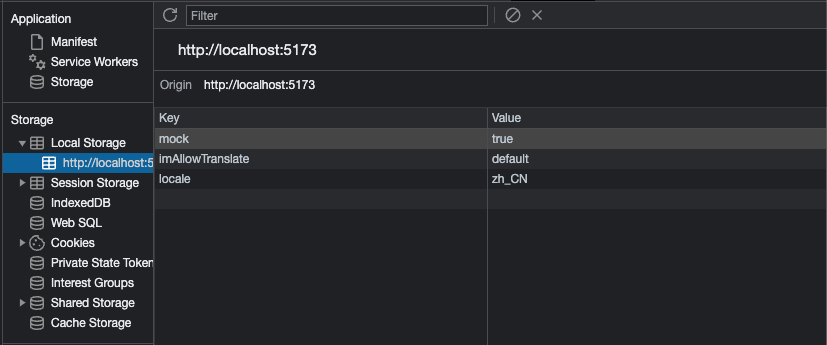
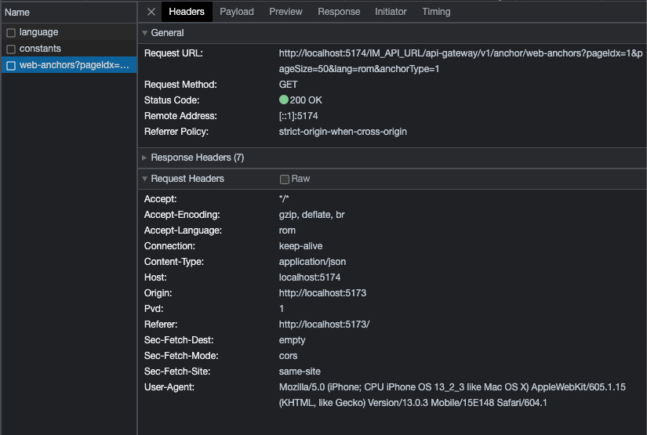

### Api

存放業務 api 的模組．內含 http request、websocket。

專案是使用 [fetch api](https://developer.mozilla.org/zh-TW/docs/Web/API/Fetch_API/Using_Fetch) 做 http request 請求，多封裝了一層方便使用與型別判斷。

細節： `packages/api/base.ts`

#### folder structure

```bash
| |--core/ # 存放核心 ws 模組
| |--echo/ # (unused)
| |--im/ # (unused)
| |--stompMaster/ # (unused)
| |--wsMaster/ # im ws 入口
| |--base.ts # 存放核心 api 模組(可以移到core裏)
| |--index.ts # 入口
| |--types.ts # api 型別宣告
```

---

#### 加入新 api 及 mock api 方式

1. 到 `packages/api/im/index.ts` 加上新的 api method 至 api class
```javascript
webAnchors = this.apiGenerator<Types.IWebAnchors>({ url: `${prefix}/v1/anchor/web-anchors` })
```
2. 到 `packages/api/im/types/anchor.ts` 定義該 api 方法的型別
```javascript
export interface IWebAnchors {
  query: { // api querystring
    sid?: number
    keyWord?: string
    pageIdx: number
    pageSize: number
    lang?: string
    anchorType?: 1 | 2 // 1:賽事主播 2:充提主播
  }
  body: null // api body
  res: withData<{ // api response
    list: IWebAnchor[]
    pager: IPager
  }>
}

// packages/api/im/types/common.ts
export interface withData<T> { // 與後端定義的統一 api 格式型別
  message: string
  code: number
  data: T
  serverTime: number
}
```

3. 到 `apps/mockServer/src/mock/im/*.ts` 定義 mock api response 資料
```javascript
{
  url: `${prefix}/v1/anchor/web-anchors`, // 網址，與實際 api 一致
  timeout: 500, // 模擬 api 延遲使用的秒數設定
  // mock response
  response: ({ query }) => mock(withData<Types.IWebAnchors>({
    list,
    pager
  }))
}
```

4. 在專案內使用：
```javascript

type IWebAnchorQueryWithLocale = IWebAnchors['query']

// options 是用來做一些額外的針對 fetch api 的設定
// 像是 abort signal 的注入
export const fetchAnchorsApi = async ({ sid, keyWord, lang, pageIdx, pageSize, anchorType }: IWebAnchorQueryWithLocale, options?: any) => {
  // ...
  const response = await im.webAnchors({
    query: {
      ...(sid && { sid }),
      ...(keyWord && { keyWord }),
      pageIdx,
      pageSize,
      ...(lang && { lang }),
      ...(anchorType && { anchorType })
    },
    headers: { 'Accept-Language': get(locale) },
  }, options)
}
```

5. 當設置 localStorage 的 `mock` 為 `true` 時，會自動將 api 轉發到 http://localhost:5174 底下，做假資料的測試



