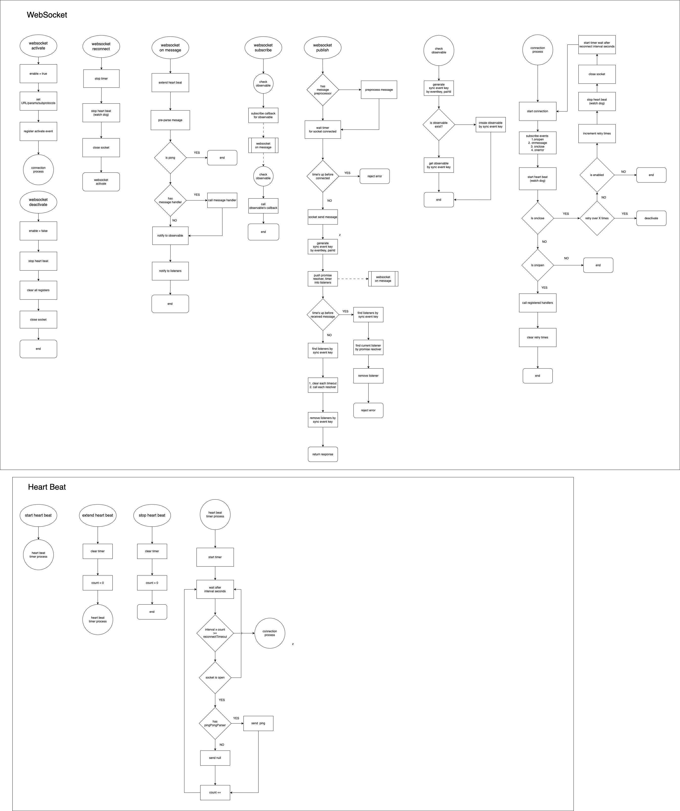

### wsMaster

核心的 websocket 模組，包含斷線重連、心跳機制、發布/訂閱模式與仿造異步 API 請求等等。

#### class properties

```javascript
class WsMaster {
  registrations: Array<() => void> = [] // 存放每次連線成功後要執行的 callback function
  listeners: { [eventkey: string]: PromiseResolver[] } // listener 是用來做 sync 用，會根據 eventkey 以及 pairId 來決定是否為 等待的回應
  defaultSyncTimeout: number // 預設的 sync 等待時間
  enabled: boolean // wsMaster 的狀態，在 activate/deactivate 時設為 true/false，若是斷線會根據此狀態決定是否重連
  retryTimes: number // websocket 斷線重連次數

  url: WsMasterProps['url'] // websocket url
  params?: { [key: string]: string | number } // websocket params
  subprotocols: WsMasterProps['subprotocols'] // websocket subprotocols
  socket: WatchDogProps['socket'] // websocket instance
  reconnectInterval: WsMasterProps['reconnectInterval'] // 重連間隔時間
  messageHandler: WsMasterProps['messageHandler'] // receive message 時執行的處理 (unused)

  watchdog: WatchDog // 心跳機制 class

  pingPongParser: WsMasterProps['pingPongParser'] // on ping/pong message 解析
  messagePreparser: WsMasterProps['messagePreparser'] // on message 解析
  binaryType: WsMasterProps['binaryType'] // receive message 的二進制訊息格式
  stopIfRetryOverTimes?: number // 設置重連超過多少次數後不再重連
  publishPreprocessor?: WsMasterProps['publishPreprocessor'] // send message 預處理

  timer?: ReturnType<typeof setTimeout> // 連線用 timer
}
```

#### class methods

```javascript
class WsMaster {
  private init() // 初始化時註冊 watch dog subscription 

  private eventHandler(event: string) // watch dog subscription's callback

  setUrl(url: string) // 設置 ws url

  setParams(params: { [key: string]: string | number }) // 設置 ws params

  setSubprotocols(subprotocols: WsMasterProps['subprotocols']) // 設置 ws subprotocols header

  async activate() // ws 連線

  reconnect() // ws 重連

  deactivate() // 將 ws 連線斷線以及將 watchdog 關閉

  private async waitingSocketClosed() // 用 promise 等待確認ws是否已經關閉

  async waitingSocketConnect() // 用 promise 等待確認ws是否已經連線

  genSyncEventkey(event: Omit<IWsMasterEvent, 'data'>) // 產生 sync event key，用在仿造異步請求的識別

  waitSync(event: IWsMasterEvent, options?: SyncOptions) // 用 promise 等待異步請求回應

  send(sendMsg: WsMessage, options?: SyncOptions) // 用 promise 等待 ws 成功發送訊息

  async sendSync(event: IWsMasterEvent, options?: SyncOptions) // 用 promise 等待異步請求回應

  notifyToListeners(event: IWsMasterEvent) // 通知等待 sync event 的監聽器執行 callback

  subscribe(event: Omit<IWsMasterEvent, 'data'>, callback: (agr0: IWsMasterEvent) => void) // 註冊 ws command 的 subscription

  async publish(event: IWsMasterEvent) // ws 發送訊息

  notifyToObservable(event: IWsMasterEvent) // 通知執行過註冊的監聽器執行 callback

  register(callback: () => void) // 註冊每次連線成功都要執行的 function

  clearAllRegisters() // 清除所有註冊的 function
}
```

#### flow chart


