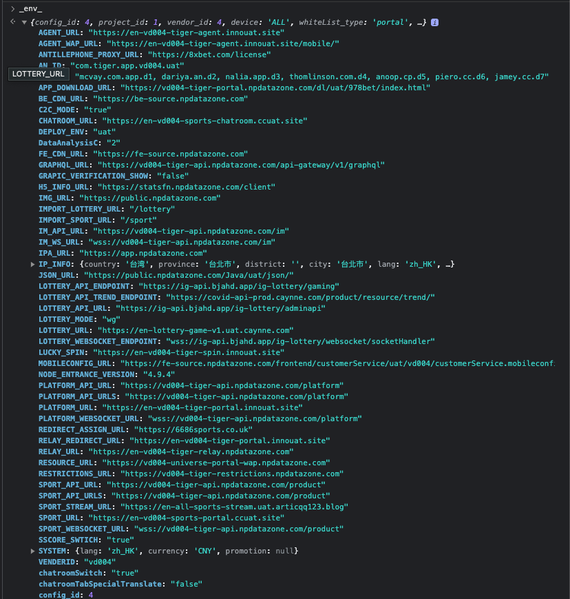

### env-config

取圖匡環境參數 `window.\_env\_` 的模組。


#### 線上環境

與 `universe-portal-wap` 專案或其他公司專案一樣，都是透過 devops 提供的圖框環境參數來決定一些環境變數，ex: api url, ws url, translate, etc。


#### 本地開發

若是要測試打包後的 `im-library` 在平台專案下取環境變數，`universe-portal-wap` 內會在 `NODE_ENV = 'development'` 時，暴露 dev 使用的 `\_env\_` 到 `window` 下供 `im-library` 抓取。

```javascript
// {YOUR_PROJECT_PATH}/universe-portal-wap/config.ts

if (!window._env_) {
  // ...
  if (process.env.NODE_ENV === 'development') {
    window._env_ = developmentConfigs(_env);
    // ...
  }
}
```